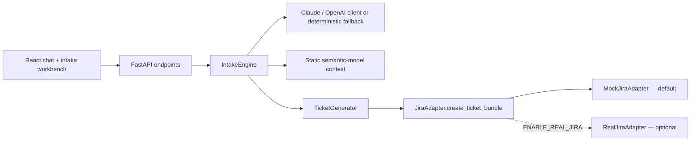

# AI BI Intake Assistant Prototype

A standalone CMU × Armada prototype for guided BI, dashboard, report, data-extract, and metric-analysis intake. The assistant captures PRD-shaped requirements, asks focused clarification questions, applies static Power BI Data Agent / Jira semantic-model context, and prepares a Jira-style draft for downstream BI delivery work.

The prototype runs outside Armada's Microsoft environment. It never connects to Power BI, Fabric, Azure, or Copilot Studio. Jira stays mock-only by default; a real Jira Cloud adapter can be enabled explicitly with backend-only credentials, and it writes only after the user selects **Create in Jira**.

## What is implemented

- React + TypeScript + Vite presentation-ready workbench
- FastAPI backend with Pydantic validation and CORS for local development
- Multi-turn, in-memory intake sessions
- Full canonical PRD-shaped intake state with scenario-specific scoring and field applicability
- Field-level confidence, source, evidence, and manual confirmation metadata
- Scenario-specific 1–3 question clarification behavior with rationale and suggested-reply chips
- Searchable/filterable 13-node Requirements Matrix with inline editing
- Full timestamped session transcript and optional sanitized `chat.txt` attachment draft
- Human validation workflow: gathering → draft ready → pending validation → validated/rejected
- Static semantic-model knowledge base for `E1_Tickets`, `OpenTickets`, `E2_Linked Tickets`, and `E3_Change Log`
- Optional Claude (or OpenAI) structured intake with deterministic fallback
- Adapter-neutral ticket generator with safe-default `MockJiraAdapter` and optional `RealJiraAdapter`
- Dual ITO + BIM Jira blueprint, proposed traceability relationship, clipboard copy, and JSON export
- Self-service semantic-model access blueprint using mock ITO access + BIM enablement/security-review drafts
- Structured feasibility, complexity, cadence, security, and data-quality validation signals
- Seven repeatable stress-test scenarios
- Automated tests for extraction, ticket generation, stress behavior, and the Jira adapter contract

## Architecture



The frontend knows only the backend API contract. The intake engine knows only the `TicketGenerator`. The ticket generator depends on the abstract `JiraAdapter`, never directly on the mock implementation.

## Jira integration boundary

Jira integration is isolated behind the adapter contract:

- `backend/app/jira_adapter.py` defines the stable interface.
- `backend/app/mock_jira.py` is the default and never performs external writes.
- `backend/app/real_jira.py` implements Jira Cloud REST API v3 issue creation, linking, and optional attachments.
- `backend/app/main.py` selects the adapter once at startup.
- The frontend, routes, intake engine, and ticket generator do not contain Jira credentials or direct Jira API calls.
- Real Jira requires `ENABLE_REAL_JIRA=true` plus `JIRA_BASE_URL`, `JIRA_EMAIL`, and `JIRA_API_TOKEN`.
- Chat and automatic draft refreshes always use a local mock preview. A real write can occur only through the explicit **Create in Jira** action.
- If real Jira is disabled or credentials are incomplete, the application safely falls back to `MockJiraAdapter`.

## Jira ticket-bundle payload contract

The primary handoff contract is a two-ticket blueprint: an ITO intake/request draft and a BIM BI-delivery draft. Requester name and email are written into both descriptions. Unknown Jira configuration is represented explicitly as `To be confirmed by Jira integration`; the prototype does not invent project keys, Issue Type values, relationship types, or enterprise fields.

For `Self-Service Access`, the same unchanged bundle schema is used: ITO describes the access/source request and BIM describes BI enablement, dataset suitability, and security review. Metrics, display format, and refresh are rendered as `Not applicable — self-service access`. A Jira ticket still does not grant Power BI permission.

```json
{
  "ito_ticket": {
    "project_category": "ITO",
    "issue_type": "To be confirmed by Jira integration",
    "summary": "BI request intake: Sales performance dashboard",
    "description": "Requester, email, scenario, business request, decision, audience, constraints...",
    "priority": "High",
    "labels": [],
    "attachments": [
      {
        "filename": "chat.txt",
        "content_type": "text/plain",
        "content": "Sanitized transcript text",
        "included": true,
        "uploaded": false
      }
    ]
  },
  "bim_ticket": {
    "project_category": "BIM",
    "issue_type": "To be confirmed by Jira integration",
    "summary": "Sales performance dashboard",
    "description": "Requester, email, purpose, source, metrics, scope, RLS, refresh, acceptance criteria...",
    "priority": "High",
    "labels": [],
    "attachments": []
  },
  "proposed_relationship": {
    "direction": "Proposed BIM → ITO traceability relationship",
    "relationship_type": "To be confirmed by Jira integration",
    "created": false
  },
  "validation_state": "draft_ready",
  "created_by": "AI Intake Prototype"
}
```

The adapter returns local keys plus the unchanged validated payload:

```json
{
  "ito_ticket_key": "DRAFT-ITO-1001",
  "bim_ticket_key": "DRAFT-BIM-1002",
  "status": "Draft Only",
  "created": false,
  "message": "No real Jira ticket was created. This is a prototype draft bundle.",
  "payload": { "...": "the validated JiraTicketBundlePayload" }
}
```

The original single-ticket `TicketPayload` below remains in the API for compatibility and presentation summaries, but new integrations should implement the bundle contract.

### Legacy normalized ticket summary

Every Jira adapter receives the following normalized `TicketPayload`. Fields are validated by Pydantic before the adapter is called.

```json
{
  "title": "Sales performance dashboard",
  "project_category": "BIM",
  "source_request_category": "SCP | ITO | unknown",
  "summary": "Short request summary",
  "business_purpose": "Decision or problem supported",
  "requester": "Requester name or Not supplied",
  "owner": "Accountable owner",
  "audience": "Recipients and access roles",
  "data_sources": ["Salesforce"],
  "metrics_or_kpis": ["Units sold", "Revenue"],
  "display_format": "Power BI dashboard",
  "refresh_frequency": "Daily",
  "scope": "Agreed scope and filters",
  "acceptance_criteria": ["Testable acceptance criterion"],
  "success_criteria": ["Business outcome or validation criterion"],
  "risks_and_assumptions": ["Risk or assumption"],
  "suggested_priority": "Medium",
  "linked_ticket_suggestion": "SCP-1234 or a traceability recommendation",
  "implementation_notes": ["Delivery note"],
  "created_by": "AI Intake Prototype"
}
```

The adapter returns:

```json
{
  "ticket_key": "DRAFT-BIM-1001",
  "status": "Draft Only",
  "created": false,
  "message": "No real Jira ticket was created. This is a prototype draft.",
  "payload": { "...": "the validated TicketPayload" }
}
```

`MockJiraAdapter` always returns `created: false`, local `DRAFT-ITO-*` / `DRAFT-BIM-*` identifiers, and never uploads the optional transcript.

`RealJiraAdapter` creates the ITO issue first, creates the BIM issue with the ITO key in its summary, links the pair, and then uploads included attachments. Jira project keys, issue types, and link type are controlled by backend environment variables.

## Run locally

### Backend

Requires Python 3.11 or newer.

```bash
cd backend
python -m venv .venv
source .venv/bin/activate
pip install -r requirements.txt
uvicorn app.main:app --reload --port 8000
```

The API is available at `http://localhost:8000`; interactive API documentation is at `http://localhost:8000/docs`.

### Frontend

Requires Node.js 18 or newer.

```bash
cd frontend
npm install
npm run dev
```

Open the local URL printed by Vite, normally `http://localhost:5173`.

Vite proxies `/api` and `/health` to `http://localhost:8000`, so no frontend API configuration is required for the standard local setup.

## Environment variables

Copy the backend example only if you want to configure an LLM:

```bash
cp backend/.env.example backend/.env
```

| Variable | Purpose | Default |
|---|---|---|
| `LLM_PROVIDER` | Cloud LLM: `claude` or `openai` | `claude` in `.env.example` |
| `ANTHROPIC_API_KEY` | Anthropic API key (preferred) | Empty; deterministic fallback is used |
| `ANTHROPIC_MODEL` | Claude model id | `claude-sonnet-4-5` |
| `OPENAI_API_KEY` | Optional OpenAI key if `LLM_PROVIDER=openai` | Empty |
| `OPENAI_MODEL` | OpenAI model name | `gpt-4o-mini` |
| `DOTENV_OVERRIDE` | Let `backend/.env` replace stale shell values during local startup | `true` |
| `ENABLE_REAL_JIRA` | Enable Jira Cloud writes through `RealJiraAdapter` | `false`; mock previews only |
| `JIRA_BASE_URL` | Jira Cloud site URL | Required only when real Jira is enabled |
| `JIRA_EMAIL` | Jira Cloud account email | Required only when real Jira is enabled |
| `JIRA_API_TOKEN` | Jira Cloud API token | Required only when real Jira is enabled |
| `ITO_PROJECT_KEY` / `BIM_PROJECT_KEY` | Jira project keys | `ITO` / `BIM` |
| `ITO_ISSUE_TYPE` / `BIM_ISSUE_TYPE` | Jira issue type names | `Task` / `Story` |
| `JIRA_LINK_TYPE` | Jira issue-link type | `Relates` |
| `FRONTEND_ORIGINS` | Comma-separated CORS origins | Local Vite origins |
| `VITE_API_BASE_URL` | Optional frontend API origin | Empty; use Vite proxy |

Never put API keys in `frontend/.env`, frontend code, browser storage, or source control. `backend/.env` and all `.env` files are ignored by Git.

## LLM behavior and fallback

With `LLM_PROVIDER=claude` and `ANTHROPIC_API_KEY` set, `backend/app/llm_client.py` calls Anthropic Claude with a tool-enforced intake schema. With `LLM_PROVIDER=openai` and `OPENAI_API_KEY`, it uses OpenAI Chat Completions with strict Structured Outputs. If `LLM_PROVIDER` is omitted and only an OpenAI key is configured, OpenAI remains the default. In every cloud-provider path, the server reconciles canonical fields, chooses questions from the active scenario profile, and recomputes scoring, readiness, risks, and validation eligibility. Obvious fields are pre-extracted deterministically before the model call so multi-turn state is stable.

The API and UI make every call observable:

- `llm_provider: claude` or `openai` means the model response passed parsing.
- `llm_request_id` contains the provider request ID when available.
- `llm_model` and `llm_latency_ms` identify the resolved model and measured round trip.
- `llm_provider: deterministic` with `fallback_reason` means the cloud attempt failed or no key was configured.

Structured schemas avoid dynamic-key objects. The model returns field metadata updates as a list of `{field, confidence, source, evidence, updated_at}` objects; the intake engine converts them into the parallel field-keyed dictionary exposed to the frontend.

If the key is absent—or if the API returns invalid output, a network error, quota error, or any other failure—the same request is processed by the deterministic engine. Existing intake state is preserved. The fallback is never silent: each intake response reports `llm_provider`, `llm_model`, `llm_request_id`, `llm_latency_ms`, and `fallback_reason`, and the frontend displays the active mode beside every assistant message. The fallback:

- extracts common deliverables, audiences, source systems, validators, metrics, owners, relative deadlines, requested/source cadence, RLS, priorities, and linked-ticket hints;
- scores scenario-specific required and recommended fields;
- asks up to three scenario-appropriate or risk-resolution questions;
- flags missing fields, source-cadence gaps, unrealistic deadline/complexity combinations, OpenTickets inconsistencies, dirty data, sensitive data, and user fatigue;
- generates a draft only after all minimum field groups are present.

## API endpoints

| Method | Endpoint | Purpose |
|---|---|---|
| `GET` | `/health` | Health check |
| `GET` | `/api/context/summary` | Static table descriptions, terminology, and warnings |
| `GET` | `/api/sample-requests` | Demo prompts |
| `GET` | `/api/llm/status` | Safe provider/model configuration status; never returns the API key |
| `GET` | `/api/jira/status` | Safe mock/real Jira adapter status; never returns credentials |
| `POST` | `/api/intake/message` | Extract, clarify, score, and optionally preview a draft |
| `POST` | `/api/intake/reset` | Clear one in-memory session |
| `PATCH` | `/api/intake/field` | Edit/confirm one whitelisted canonical intake field |
| `POST` | `/api/intake/validation/submit` | Submit an eligible intake for human validation |
| `POST` | `/api/intake/validation/approve` | Approve a pending validation draft |
| `POST` | `/api/intake/validation/reject` | Return a pending/validated draft for revision |
| `POST` | `/api/intake/generate-ticket` | Generate a mock bundle, or explicitly create linked Jira issues when real Jira is enabled |
| `POST` | `/api/intake/attachments` | Add an optional attachment to the current intake session |
| `DELETE` | `/api/intake/attachments` | Remove a pending attachment before Jira creation |
| `GET` | `/api/stress-test/scenarios` | Scenario catalog used by the UI |
| `POST` | `/api/stress-test/run` | Run a repeatable scenario through the same engine |

## Scenario profiles and completion logic

Required groups contribute 80% of the score and recommended fields contribute 20%. The active profile controls both readiness and question order:

- **New Dashboard** requires purpose, audience, source, metrics/fields, format, requester/owner, and success/validator.
- **Existing Report Issue** requires the affected report, expected-versus-actual problem, affected audience, source, owner, and validator.
- **Enhancement Request** requires the existing report, bounded change, affected audience, source impact, owner, and acceptance/validator.
- **Self-Service Access** requires user/role, semantic model or dataset, business purpose, data scope, and security/data approval owner. Metrics, display format, and refresh are not applicable.
- **Ambiguous Request** and **Unassigned** cannot draft until the workflow is classified.

When all required groups are complete, the assistant stops asking chat questions and enables the local draft. Remaining recommended gaps are shown as **Optional refinements** and remain editable in the Requirements Matrix.

Human validation is a separate gate. Submission requires at least 70%, the active profile's required groups, requester/owner, requester email or an explicit unavailable marker, Jira Issue Type or the explicit integration placeholder, priority, no ambiguity in blocking fields, and no unresolved structured security, data-quality, cadence, deadline, or complexity signal. Feasibility risks may appear in a draft but must be mitigated before human validation. Validation never submits Jira tickets; it only changes local session state.

## Stress tests

Use the **Scenario lab** tab in the web app, or call `POST /api/stress-test/run` with one of:

- `happy-path`
- `vague-request`
- `missing-data-source`
- `conflicting-refresh`
- `dirty-data`
- `human-fatigue`
- `security-boundary`

Each result includes a transcript, final structured intake, optional draft, findings, and risk flags.

Run automated tests:

```bash
cd backend
source .venv/bin/activate
pytest -q
```

Build the frontend:

```bash
cd frontend
npm run build
```

## Safety and disclaimer

- Every generated ticket is labeled **Draft Only**.
- The prototype never claims that a Jira issue or link was created.
- It has no live Armada, Jira, Power BI, Fabric, Azure, or Copilot Studio access.
- Static context is used as directional guidance, not live fact.
- It does not invent exact ticket counts.
- Users are prompted to use sanitized or aggregate data, not sensitive/internal records.
- In-memory session state is lost when the backend restarts; no database is required.

## Future work

1. Real Jira integration after security review
2. Real Copilot Studio deployment
3. Real Power BI / Fabric connection
4. Authentication
5. Role-based access control
6. Persistent database
7. Human approval workflow
8. Deployment hardening
9. Enterprise security review
